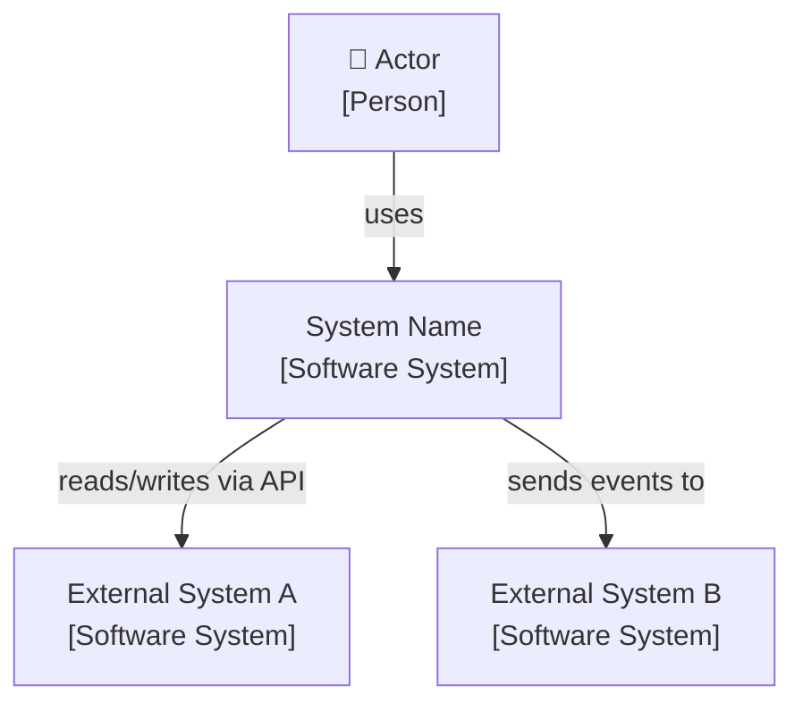
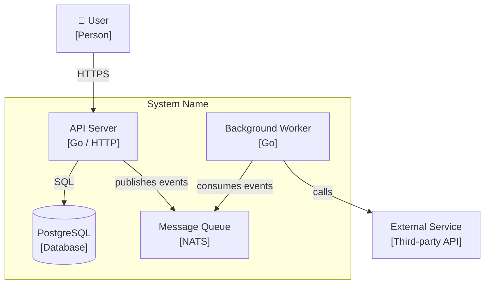
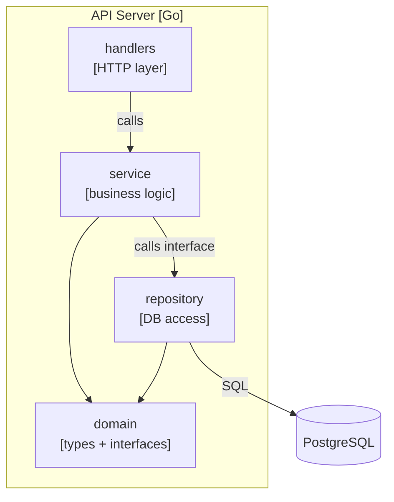
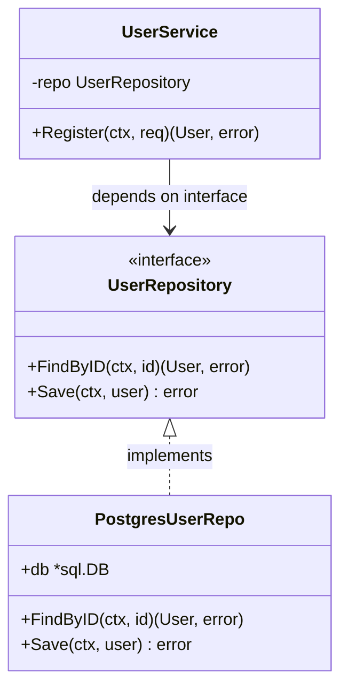

# Skill: c4-architecture

**Trigger:** User asks to design, diagram, document, or review system architecture — or when filling in `.claude/rules/01-architecture.md`.

Apply automatically. Produce diagrams in Mermaid (renders in GitHub, JetBrains, VS Code).

---

## C4 Model — Four Levels

Work top-down. Stop at the level that answers the question. Do not produce L3/L4 diagrams unless asked — they go stale fast.

### Level 1 — System Context

Who uses the system, what external systems it talks to. One diagram per system.

```
Actors + external systems only. No internals.
```



Questions to answer before drawing:
- Who are the users (human actors)?
- What external systems does this integrate with?
- What does this system do from the outside-in perspective?

---

### Level 2 — Container

Deployable units inside the system boundary. Processes, databases, queues, frontends.

```
Each box is something you deploy or run. Show tech stack per box.
```



Questions to answer before drawing:
- What runs as a separate process?
- What data stores exist and who owns them?
- How do containers communicate (sync HTTP, async queue, gRPC)?

---

### Level 3 — Component

Internal structure of one container. Packages, modules, major interfaces.

Only draw when: a container is complex, onboarding someone to a specific container, or documenting a non-obvious boundary.



Go-specific rule: package boundaries ARE component boundaries. One component = one package. If a package does two things, split it.

---

### Level 4 — Code

Class/struct diagrams for a single component. Only when: explaining a subtle design decision, documenting a non-obvious interface contract, or onboarding.

Do not generate L4 diagrams routinely — they rot within days of a refactor.

Use Go interface notation:



---

## Rules for All Levels

1. **Label every arrow** — direction + protocol/method. Unlabeled arrows hide assumptions.
2. **Show tech stack** — `[Go / gRPC]`, `[PostgreSQL]`, `[NATS]`. Diagrams without tech are vague.
3. **Boundaries matter** — draw a box around what you own. Everything outside is external.
4. **One concern per container** — if you can't name a container's job in 5 words, split it.
5. **Cross-ref rules file** — after producing a diagram, check it against `.claude/rules/01-architecture.md`. If the rules file is a stub, ask the user if the diagram should be used to fill it in.

## Output Format

When producing a C4 artifact:

```
## C4 — Level N: [Name]

[1-sentence scope statement]

[Mermaid block]

**Decisions recorded here:**
- Why [X] is a separate container and not a library
- Why [Y] communicates async not sync
- [Any non-obvious constraint]
```

Decisions belong with the diagram — not in a separate doc. They rot separately.
